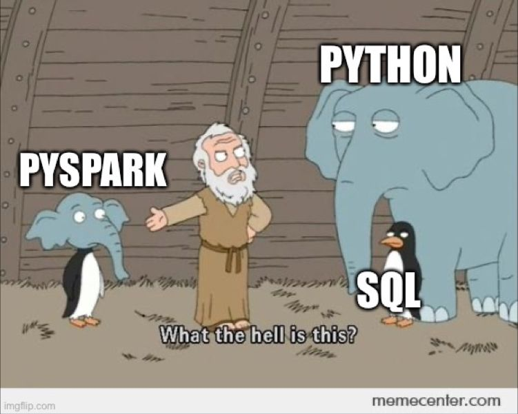

# PySpark Notes

## Links

0. [Install libs (zoocamp)](https://github.com/DataTalksClub/data-engineering-zoomcamp/tree/main/05-batch/setup)
1. [PySpark command](https://github.com/joeyism/Commonly-Used-Pyspark-Commands)
2. [Zoocamp: Batch processing with pyspark](https://github.com/DataTalksClub/data-engineering-zoomcamp/tree/main/05-batch)
3. [How to connect to s3 and read data](https://medium.com/@nickhass3/how-to-connect-local-pyspark-to-aws-s3-and-read-a-delta-table-40ae5a9295b4)
4. [Read CSV](https://sparkbyexamples.com/pyspark/pyspark-read-csv-file-into-dataframe/)
5. [PySpark deltalake-minio](https://github.com/rylativity/pyspark-deltalake-minio)
6. [Datacamp: Big Data with PySpark](https://app.datacamp.com/learn/skill-tracks/big-data-with-pyspark)
